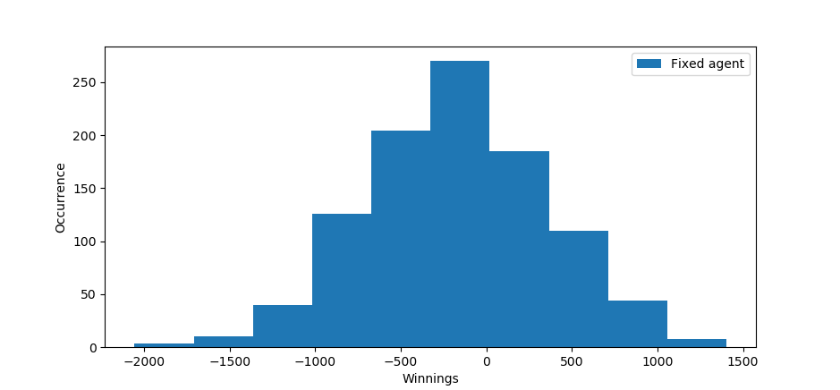

# Method
## Part 1 (robot)
The different agents is doing as expected according to the criteria in assignment (a-c). However the reflex with memory agent works a little different. In order to confirm that the robot doesn't run into the walls so the critera for bonus part will be uphold additional sensors were introduced. It was discovered during the lab that it cant be ensured that the robot won't hit a wall unless the robot have knowledge of the surrounding area. The greater view the more information and the decision can be based on it to give a better path for the robot.
The robot does not know anything about it's surrounding except what is given from the sensors. It can take a lot of time to finish the map and the possibility to stay on one place on the map have a high probability. Since the robot first follow a random pattern and then if the robot find a target close enough the direction will change and go towards it, if it fail collecting, the robot will start going random again. Alternative solutions for would include:

* Store what the robot have done and try to create an internal map by storing data from the sensors. This would make the robot know were and what it is doing and from there navigate though the map.  
* An algorithm that make the robot cover the full map, this could however mean that it would ignore were the target is until it is close enough.

## Part 2 (poker)
The poker game is built upon the different agents. The project is structured with the following classes: Agent, Board, Deck, Hand and Simulation, Observer and additional agents that inherit the Agent and Observer class. The main program is called by creating an Simulation object. Since all is object we can do multiple agents on one board. By passing the agent object as an index we can store each opponent for the agent and it can make decision based on correlation. For example: The agent, reflexMem2Agent knows about it's opponents hand and bet, and can therefor make a decision based on it. After a few rounds the agent know who the opponents type is (minimal amount of data to do correlation). The agent will always try to make the highest bid that would make them win but will lower the bid if any other agent may have better cards based on their bet. 

According to figure \ref{Fixed} we can see that both the fixed and random agents perform almost equally and the graph is normally distributed if their mean bet is 25 and do 1000 games, and each game contains 50 rounds. Reminder that this check for part d only checks agent 0 (can be modified in main and is therefor assumed that this is the agent we are looking at.

# Conclusion
Additional improvements could be made to the first part, including algorithm for better search or more sensors to give a better view of the surrounding.

The second part is flexible and dynamic since it can handle multiple agents of different kindes and is easy to implement new onces without breaking the game. A few part is less dynamic like the performance check of an agent (only handle first if not changed in the Simulation code). 

# Appendix

