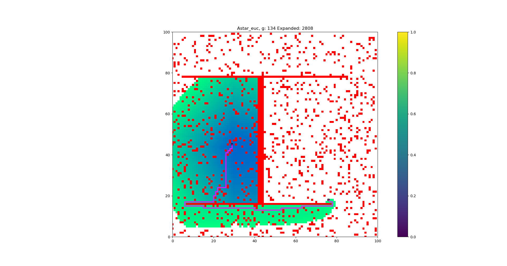
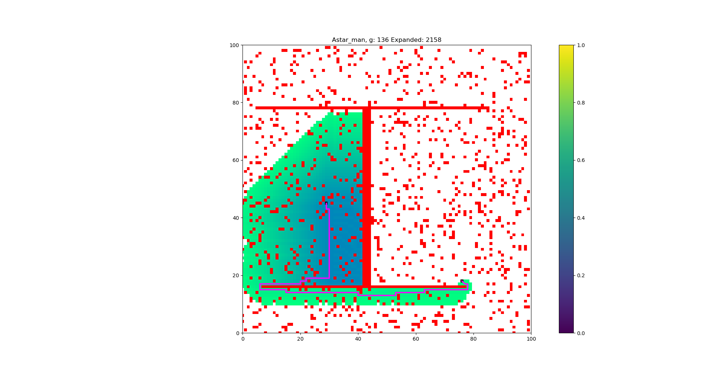
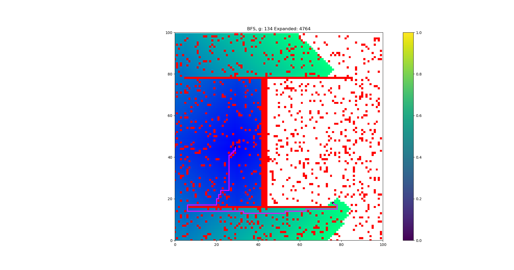
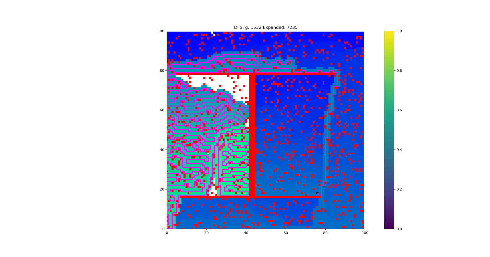
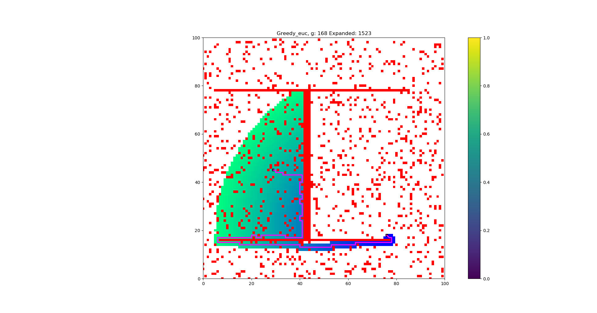
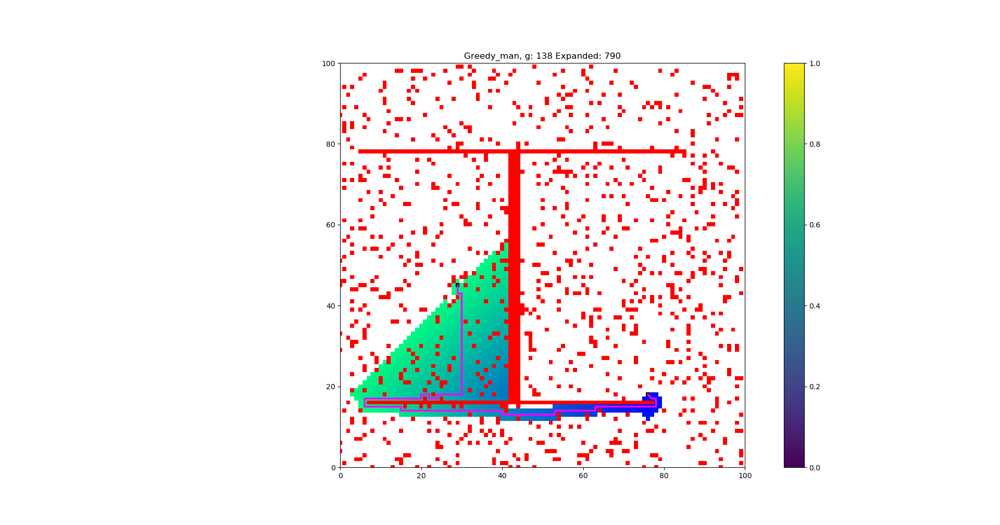
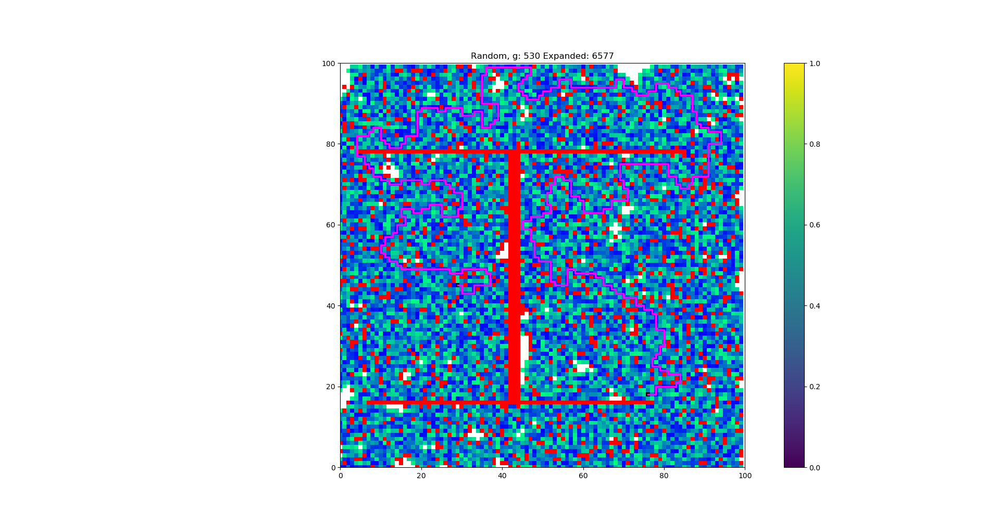
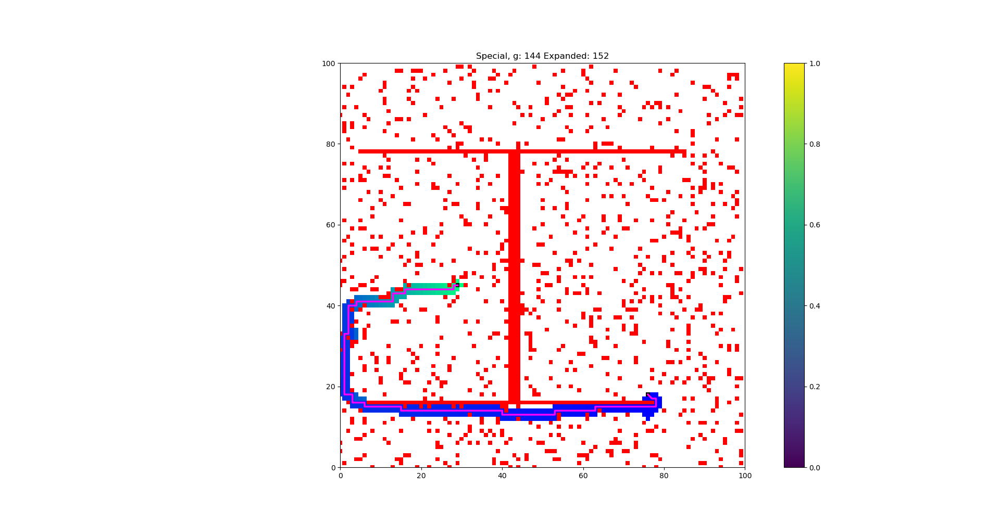

# Part 1 - Path planning

The project is structured to inherit an cost function depending on input into the search algorithm. Every function uses the Queue. According to the table below it is possible to see that BFS were equal mach in g value against A* and random. However the expanded nodes is greatly higher in Random followed by BFS. Conclusion is that Random is bad, BFS is good but compared to A* it is not good enough. However, Greedy search have the lowest expanded nodes next to Special but the path cost increases. Finally we can see that Special performs best in the matter of expanded nodes but due to its static path of avoidance it is not recommended for changing environments. Comparing the heuristics (Observe the images) we can see that manhattan performs better for both A* and Greedy with small margins in A*. However the gap between the expanded nodes is relative high. The special heuristics main target is to go where posX,posY that is the position current position and x, y1,y2 is the given positions of the obstacle. So the following is implemented:
If $posX < x$ and $y1 > posY > y2$ then move to the left and multiply with a huge number so it wont go back into the obstacle. Then apply manhattan distance to start searching for the node.

| Type             	| g    	| Expanded nodes 	|
|------------------	|------	|-------	|
| BFS              	| 134  	| 4764  	|
| DFS              	| 1532 	| 7235  	|
| Random           	| 530  	| 6577  	|
| Greedy euclides  	| 168  	| 1523  	|
| Greedy manhattan 	| 138  	| 790   	|
| A* euclides      	| 134  	| 2808  	|
| A* manhattan     	| 136  	| 2158  	|
| Special          	| 144  	| 152   	|

# Part 2 - Poker
There is a few differences from the first part and part 2. The inheritances were reduced since an easier way to calculate each cost were found. However this cost a little more performance but not very noticable. In the table below we can see how the different algorithms performs. Interesting enough A* was the worst one with an extreme expanding followed by DFS. They all won even though a theory that Random would fail at least once. This could have been prevented since none of the algorithms are allowed to visit a node more than once. So if it is visited they cant visit it again. Limitations on depth, hand draw limitations and random step exists and once we find the goal we break and return the path. 

Two different heuristics were implemented as complement (bonus part): One works towards how many bets that have been done, as it was described in the lab and the second how much money the agent have and the sum in the pot. The interesting about these tables is little the A* and greedy expands when searching for the biggest pot. However A* have a worse g value but greedy performs overall better. This test was done during 30 runs and the values are average of each parameter.

Using MANY as a heuristic the g value is lowered and performs overall better but the search space is higher. On the other hand BIG lowerest the search space but with increased g value. 

Using MANY as heurisic (default):

| Type             	| heuristic | g    	| Expanded nodes    | Win rate/rounds  |
|------------------	|-----------|------	|--------------     |---------------   |
| BFS              	| None      | 10.34 | 26294.42	        | 100\/100         |
| DFS              	| None      | 19.69 | 109090.15         | 100\/100         |
| Random           	| None      | 15.99 | 811.82  	        | 100\/100         |
| Greedy  	        | MANY bids | 17.88 | 855.65   	        | 100\/100         |
| Greedy  	        | BIG pot   | 16.89 | 49.31   	        | 100\/100         |
| A*       	        | MANY bids | 10.52 | 130277.51 	    | 100\/100         |
| A*       	        | BIG pot   | 16.41 | 47.83 	        | 100\/100         |

# Appendix
{ width=50% }

{ width=50% }

{ width=80% }

{ width=80% }

{ width=80%}

{ width=80%}

{ width=80% }

{ width=80% }
